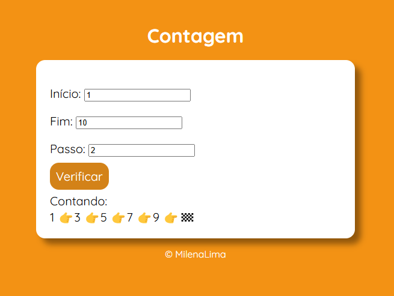
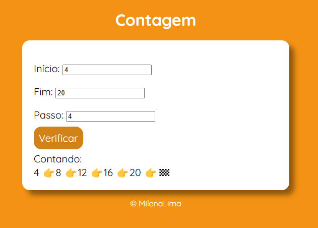

# 🔢 Projeto Contagem

Este é um projeto simples desenvolvido com **HTML, CSS e JavaScript** que realiza uma contagem numérica com base nos valores fornecidos pelo usuário.  
📌 Desenvolvido como parte das aulas do **Professor Guanabara - Curso em Vídeo**.   

---

## 🎯 Funcionalidades  

✔️ O usuário define o número **inicial** da contagem.  
✔️ O usuário define o número **final** da contagem.  
✔️ O usuário define o **passo** (de quanto em quanto a contagem será feita).  
✔️ O resultado é exibido na tela, com **emojis** para representar a sequência.  
✔️ Suporta **contagem crescente** e **contagem regressiva**.  
✔️ Caso o usuário não preencha todos os campos, uma mensagem de erro será exibida.  
✔️ Se o passo for **0 ou negativo**, o sistema ajusta automaticamente para **1**.  

---

## 🚀 Tecnologias Utilizadas

- **HTML5** → Estrutura da página  
- **CSS3** → Estilização e layout responsivo   
- **JavaScript** → Lógica para realizar a contagem  

---

## 📷 Demonstração  
🔹 **Tela Inicialmente**  
  

🔹 **Exemplos do Resultado da Contagem**  
  

  

